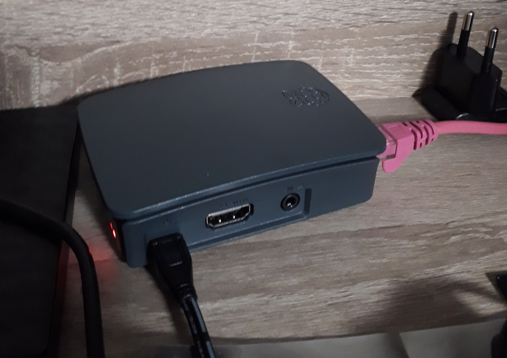

So, the WiFi at my flat sucks. And has done for several weeks. In essence, the
company that manages my university accommodation's internet is not exactly
wonderful. If I use a wired connection it's fine - but good luck trying to get
a wireless one.

So after spending days trying to get across my point to my internet provider, I
gritted my teeth, bought a Raspberry Pi, and set it up to be a WiFi access
point for my room that I connected to my provided ethernet port.

Here's how I did it.

# Equipment

- A Raspberry Pi (I used a model 3 B+)
- Power supply
- Micro SD card
- Ethernet cable
- Etc.

# Setup

First, I downloaded raspbian from the official [downloads page][downloads]. I
went for the minimal image, as I didn't need anything super fancy like a
desktop environment. Then I used the dd tool from my laptop to install the
image to the sd card:

    $ dd bs=4M if=2018-11-13-raspbian-stretch-lite.img of=/dev/sda conv=fsync

Then, I created an `ssh` file in `/boot` to enable ssh on bootup so that I could
get in.

# Connecting

Now, getting in to the pi is very easy if you happen to have an
additional screen and keyboard lying around. I didn't because I don't own any
of those.

Alright, but it's still quite easy if you can connect your laptop to the same
network as the pi. But my lovely internet provider doesn't link your
devices to the same subnet unless you pay an extra £25 which I was not about to
do. And then you still need to go through their custom captive portal login page,
which is not too easy to do on a pi.

So, I connected to my pi using a direct ethernet connection. While I found many
guides for this on windows, I found nothing for how to do it on linux. So
here's how to do it:

Install the required packages.

    # pacman -S dhcp nmap

Configure dhcpd. You can choose any addresses you like, but you need to make
sure that if you change one, you need to change it everywhere.

    # cp /etc/dhcpd.conf /etc/dhcpd.conf.example
    # cat << EOF > /etc/dhcpd.conf
    option domain-name-servers 8.8.8.8, 8.8.4.4;
    option subnet-mask 255.255.255.0;
    option routers 192.168.0.100;
    subnet 192.168.0.0 netmask 255.255.255.0 {
      range 192.168.0.150 192.168.0.250;
    }
    EOF

Connect the pi to your laptop. Then configure your ethernet interface (mine is
called enp0s31f6).

    # ip link set enp0s31f6 up
    # ip addr add 192.168.0.100 dev enp0s31f6

Start the dhcp server.

    # dhcpd

Wait a few moments for the raspberry pi to get an IP address. If required,
disconnect and reconnect it.

Run a scan to find the IP address of the pi. You should find a single device
connected that has port 22 open for SSH.

    # nmap 192.168.0.0/24

Connect to the pi.

    # ssh pi@192.168.0.XXX

That was a lot of fuss - so don't do if you don't have to.

# Setting up an access point

While looking around how to set up an access point, I found
[create_ap][create_ap] linked to in the ArchWiki. It manages pretty much every
basic use case you need.

First, install dependencies. If you don't have an internet connection on the pi, then
you need to download them, transfer the .dpkg to the pi using scp and install
it manually.

Then, install [create_ap][create_ap]:

    $ git clone https://github.com/oblique/create_ap.git
    $ cd create_ap
    $ make install

Again, if you don't have an internet connection on the pi, you'll need to scp
the git repo over.

Start create_ap at boot.

    $ cat << EOF > /etc/rc.local
    create_ap -m bridge wlan0 eth0 PiPoint PiPassPhrase &
    exit 0
    EOF

Finally, reboot the pi.

    $ sudo reboot

That should be pretty much all you need. Disconnect your pi from your laptop
and connect it to your ethernet port. You should then be able to see an access
point called PiPoint appear which you can conncet to.

# Conclusion

Internet providers suck. But I guess I knew that already. However - that
shouldn't stop us from building cool stuff to make it suck just a little less.

[create_ap]: https://github.com/oblique/create_ap
[downloads]: https://www.raspberrypi.org/downloads/
