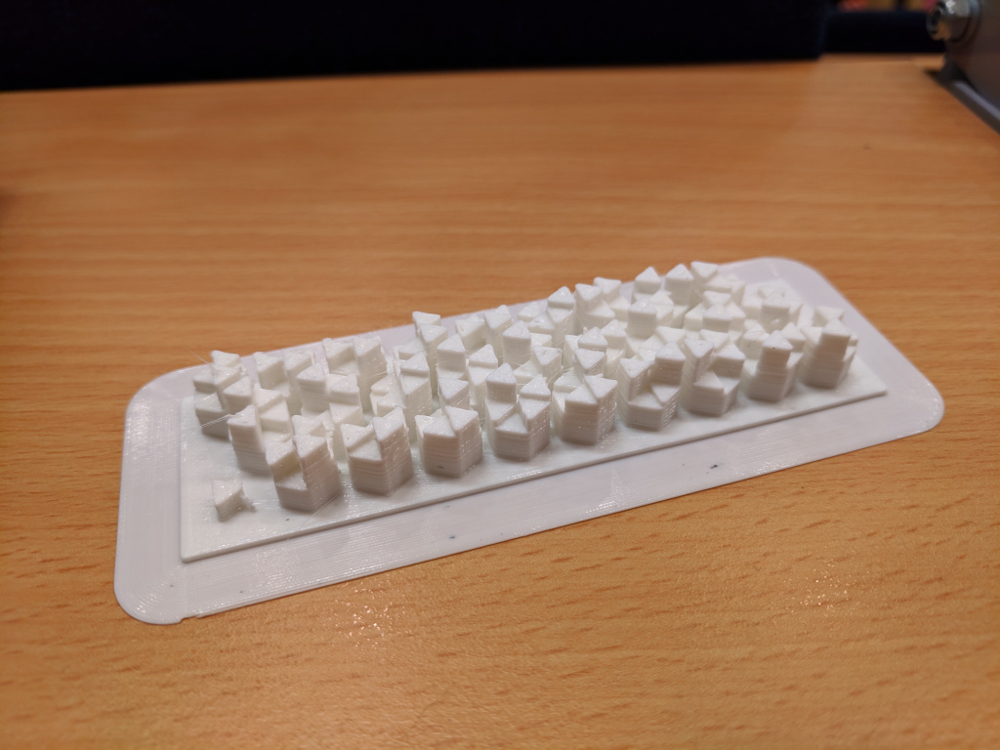

Edit: I now have a more complete writeup [here][writeup] if you are interested
in some of the more low level details of the encoding system.

Last weekend, I was at [HackSurrey][hacksurrey] for my fourth hackathon. As it
was my fourth, I felt experienced and knowledgable about how to do things. So, I
decided to do something I'd never really ever thought about doing before - 3D
printing.

Now, I've done a bit of 3D printing before, with [sculpteo][sculpteo] before,
but I've never actually printed anything manually. As it turns out, it's
surprisingly easy to do once you get started, but getting started is a bit
tricky and I required a lot of help.

# The idea

The basic idea of our hack was to create an app that could take any file from
your phone, store it on the blockchain and then encode that part of the
blockchain in a 3D object. We didn't really get the blockchain bit working as
we liked it, due to problems with interfacing with the GuardTime KSI SDK on
Android, but everything else got done.

# The encoding

Now this is what this post is mostly about - how to encode raw data in a 3D
print. There are two main goals of the design we chose to use:

1. Be able to reconstruct the original data perfectly
2. Not be too big
3. Look really pretty and nice

Here's an overview of what we did:

- Hash the data. For small chunks of data, it would be possible to store the
  whole thing, but for larger chunks we chose to just store the hash. It also
  makes every print exactly the same size.
- Convert the hash from an integer into a number in base 720.
- Convert each digit in the number into a permutation of a set of 6 heights.
- Assign the heights to 6 triangles so that they create the permutation and
  then organize them into a hexagon.
- Repeat for all the digits.

So the end result of this is a number of hexagons each with 6 triangles at
different heights, as you can see below:

In this case, we've used SHA-256 to hash the data, so we only require 27
hexagons. We've also got a little triangle marker in the bottom left corner, so
you can orient it in the correct direction - then you read left to right, top
to bottom.

# What?

Yes. You did read correctly above, we convert the number into base 720.

Base 720. At first glance (and indeed, second and third glances), this seems
like a bizarre choice. In fact, it's actually quite logical - it's the number
of possible permutations of a set of 6 items, i.e., 6 factorial. Using this we
can establish a mapping between integers and permutations allowing us to easily
create representations of a number, but also, and more importantly, get the
number back from the representation.

This conversion is done using a [factoradic][factoradic] base, you can see the
exact details [here][permute.py].

It's kind of a strange algorithm, so if you feel like it's not quite explained
well enough, get in contact and let me know :)

# Conclusion

Interesting, right?

So it's definitely not the most space efficient encoding, but you can
reconstruct the original data all perfectly, as you don't need to be able to
read the heights off, only the ordering of heights. This means it's less likely
to be affected by dust or 3d printer errors.

It also is quite pretty.

If you're interested more in seeing how we built it, including the android app,
you can check out the repo at <https://github.com/jedevc/hacksurrey-2019>.

[writeup]: https://github.com/jedevc/hacksurrey-2019/raw/master/writeup/writeup.pdf
[hacksurrey]: https://hacksurrey.uk
[sculpteo]: https://www.sculpteo.com
[factoradic]: https://en.wikipedia.org/wiki/Factorial_number_system
[permute.py]: https://github.com/jedevc/hacksurrey-2019/blob/master/hexblock/model/permute.py
